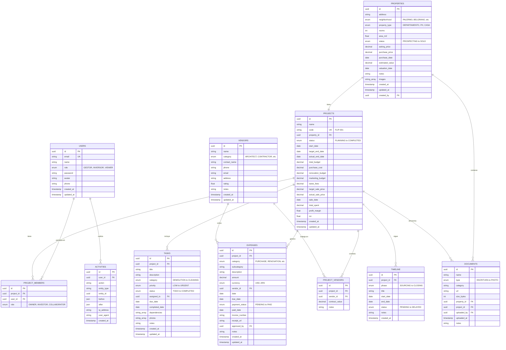

# Diagrama Entidad-Relación - Flipping Management Tool

## Modelo de Datos Completo



## Enumeraciones Clave

### UserRole
- `ADMIN`: Acceso total al sistema
- `GESTOR`: Socio Gestor (Verona) - Control operativo
- `INVERSOR`: Socio Inversor - Visualización y aprobaciones
- `VIEWER`: Solo lectura

### PropertyStatus
- `PROSPECTING`: En búsqueda
- `EVALUATING`: Bajo evaluación
- `NEGOTIATING`: En negociación
- `PURCHASED`: Comprada
- `IN_RENOVATION`: En obra
- `STAGING`: Home staging
- `ON_SALE`: En venta
- `SOLD`: Vendida
- `ARCHIVED`: Archivada

### ProjectStatus
- `PLANNING`: Planificación inicial
- `IN_PROGRESS`: Proyecto activo
- `ON_HOLD`: En pausa
- `COMPLETED`: Completado
- `CANCELLED`: Cancelado

### ExpenseCategory
- `PURCHASE`: Compra de propiedad
- `TAXES_FEES`: Impuestos y honorarios
- `RENOVATION`: Remodelación general
- `MATERIALS`: Materiales de construcción
- `LABOR`: Mano de obra
- `PERMITS`: Permisos y habilitaciones
- `UTILITIES`: Servicios (luz, agua, gas)
- `MARKETING`: Comercialización y publicidad
- `STAGING`: Home staging y fotografía
- `MAINTENANCE`: Mantenimiento
- `PROFESSIONAL`: Servicios profesionales
- `OTHER`: Otros gastos

### VendorCategory
- `ARCHITECT`: Arquitecto
- `CONTRACTOR`: Contratista general
- `PLUMBER`: Plomero
- `ELECTRICIAN`: Electricista
- `PAINTER`: Pintor
- `MASON`: Albañil
- `CARPENTER`: Carpintero
- `REALTOR`: Inmobiliaria
- `LAWYER`: Abogado
- `ACCOUNTANT`: Contador
- `STAGER`: Home stager
- `PHOTOGRAPHER`: Fotógrafo
- `MATERIALS_SUPPLIER`: Proveedor de materiales
- `OTHER`: Otros

### TaskCategory
- `DEMOLITION`: Demolición
- `PLUMBING`: Plomería
- `ELECTRICAL`: Electricidad
- `MASONRY`: Albañilería
- `PAINTING`: Pintura
- `FLOORING`: Pisos
- `CARPENTRY`: Carpintería
- `INSPECTION`: Inspección
- `PERMITS`: Permisos
- `STAGING`: Staging
- `PHOTOGRAPHY`: Fotografía
- `CLEANING`: Limpieza
- `OTHER`: Otros

### Phase (Timeline)
- `SOURCING`: Búsqueda de propiedad
- `DUE_DILIGENCE`: Due diligence
- `PURCHASE`: Compra y escrituración
- `RENOVATION`: Remodelación
- `STAGING`: Home staging
- `MARKETING`: Comercialización
- `SALE`: Negociación de venta
- `CLOSING`: Cierre

## Relaciones Importantes

1. **Properties → Projects**: Una propiedad puede convertirse en UN proyecto
2. **Projects → Expenses**: Un proyecto tiene MUCHOS gastos
3. **Projects → Tasks**: Un proyecto tiene MUCHAS tareas
4. **Projects → ProjectMembers**: Un proyecto tiene miembros (Gestor + Inversor)
5. **Vendors → Expenses**: Un proveedor cobra por MUCHOS gastos
6. **Projects → ProjectVendors**: Muchos a muchos con vendors
7. **Users → Activities**: Auditoría completa de acciones

## Índices Recomendados

```sql
-- Performance indexes
CREATE INDEX idx_properties_status ON properties(status);
CREATE INDEX idx_properties_neighborhood ON properties(neighborhood);
CREATE INDEX idx_projects_status ON projects(status);
CREATE INDEX idx_expenses_project ON expenses(project_id);
CREATE INDEX idx_expenses_date ON expenses(date);
CREATE INDEX idx_tasks_project_status ON tasks(project_id, status);
CREATE INDEX idx_activities_user_created ON activities(user_id, created_at);

-- Search indexes
CREATE INDEX idx_properties_address ON properties USING gin(to_tsvector('spanish', address));
CREATE INDEX idx_vendors_name ON vendors USING gin(to_tsvector('spanish', name));
```

## Constraints de Negocio

```sql
-- Una propiedad solo puede tener un proyecto activo
ALTER TABLE projects ADD CONSTRAINT unique_active_project_per_property 
  EXCLUDE USING gist (property_id WITH =) 
  WHERE (status IN ('PLANNING', 'IN_PROGRESS'));

-- Total spent no puede exceder total budget * 1.2
ALTER TABLE projects ADD CONSTRAINT check_budget_overrun 
  CHECK (total_spent <= total_budget * 1.2);

-- ROI calculation
ALTER TABLE projects ADD CONSTRAINT check_roi_calculation 
  CHECK (
    (actual_sale_price IS NULL AND roi IS NULL) OR
    (actual_sale_price IS NOT NULL AND roi = ((actual_sale_price - total_spent) / total_spent * 100))
  );
```

---

*Versión: 1.0 | Fecha: Abril 2026*
